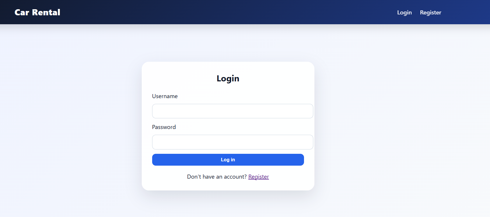
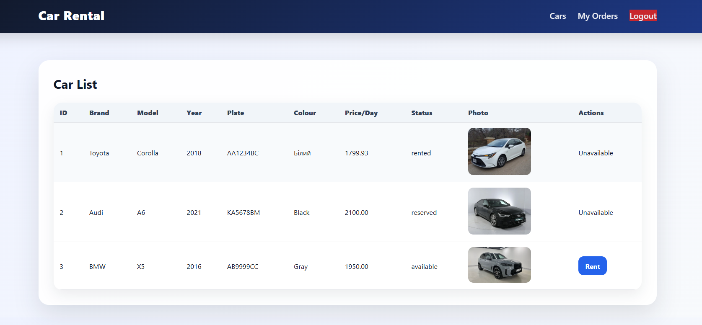
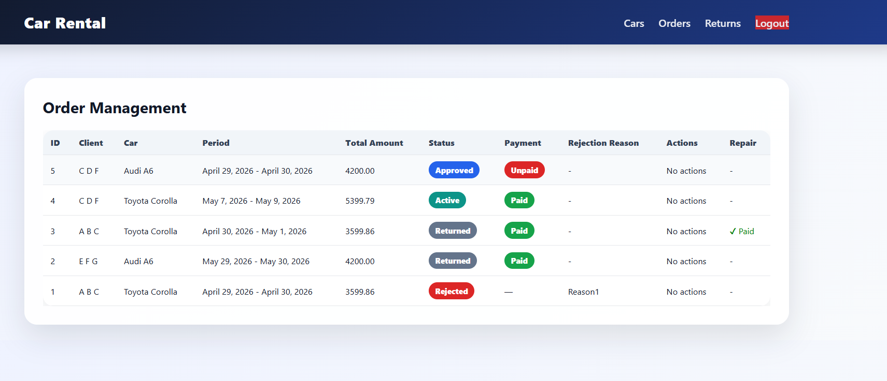
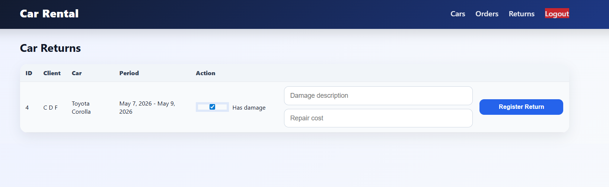

# 🚗 Car Rental System

A web application for managing car rentals, built with **Django**.  
The system supports separate workflows for **customers** and **administrators**: customers can book and pay for cars, while administrators manage cars, rental requests, returns, and repair invoices.

🌐 **Live Demo:**  
https://kp432030.pythonanywhere.com/

---

## ✨ Features

### 👤 Customer Side

- Register and log in
- Browse available cars
- Create rental orders
- View personal orders
- Pay for approved rentals using a simulated Google Pay page
- View rejected orders and rejection reasons
- Pay repair fees if vehicle damage was registered by the administrator
- Track rental, payment, and repair statuses

### 🛠 Admin Side

- Add new cars
- Edit and delete cars
- Manage car availability through order workflow
- Approve or reject rental orders
- Provide rejection reasons
- Register car returns
- Mark returned cars as damaged or undamaged
- Create repair invoices for damaged cars
- Track paid and unpaid repair invoices

---

## 🔐 Demo Accounts

### Admin

```text
Username: admin1
Password: admin12345
```

### Customer

```text
Username: client1
Password: 12345
```

---

## 🚘 Car Statuses

- `available` — the car can be rented
- `reserved` — the car has an approved order but is not yet paid
- `rented` — the rental is paid and active
- `maintenance` — the car is not available for rental

---

## 📦 Order Workflow

```text
pending → approved → active → returned
   ↘ rejected
   ↘ damage_pending → repair paid → returned
```

### Status Meaning

- `pending` — customer created an order and waits for admin approval
- `approved` — admin approved the order; customer can pay
- `active` — rental is paid and car is currently rented
- `returned` — car was returned successfully
- `rejected` — admin rejected the order and added a reason
- `damage_pending` — car was returned with damage and customer must pay repair invoice

---

## 💳 Payments

The application includes a simulated payment flow:

- Rental payment
- Repair payment
- Google Pay-style confirmation page

No real money is charged. The payment page only imitates the payment confirmation process for educational purposes.

---

## 🧾 Repair Invoice Logic

If a car is returned with damage:

1. The administrator registers the damage.
2. A repair invoice is created.
3. The order receives the `damage_pending` status.
4. The customer pays the repair invoice.
5. After payment, the order becomes `returned` and the car becomes available again.

---

## 🖼 Screenshots







---

## 🛠 Tech Stack

- Python
- Django
- SQLite / PostgreSQL
- HTML
- CSS
- Django Authentication
- PythonAnywhere

---

## ⚙️ Installation

```bash
git clone https://github.com/kate20031/CarRental2.git
cd CarRental2

python -m venv venv
venv\Scripts\activate

pip install -r requirements.txt

python manage.py migrate
python manage.py runserver
```

Open the project locally:

```text
http://127.0.0.1:8000/
```

---

## 👤 Creating an Admin User

```bash
python manage.py createsuperuser
```

After creating a superuser, log in through:

```text
http://127.0.0.1:8000/login/
```

Admin users are detected using Django's built-in `is_staff` field.

---

## 🌐 Deployment

Live version:

https://kp432030.pythonanywhere.com/

The project is deployed on **PythonAnywhere**.

---

## 📁 Main Project Structure

```text
CarRental2/
├── accounts/
│   ├── models.py
│   └── views.py
├── cars/
│   ├── models.py
│   └── views.py
├── orders/
│   ├── models.py
│   └── views.py
├── templates/
│   ├── layouts/
│   ├── cars/
│   └── orders/
├── static/
│   └── style.css
├── config/
│   ├── settings.py
│   └── urls.py
└── manage.py
```

---

## 👩‍💻 Author

**Kate Pavlichenko**  
GitHub: https://github.com/kate20031
